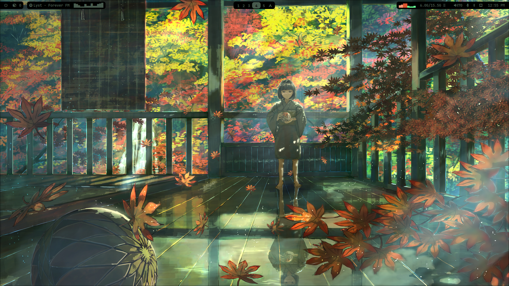
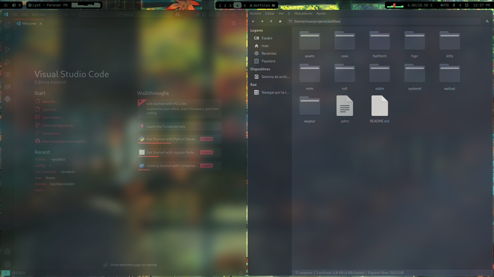
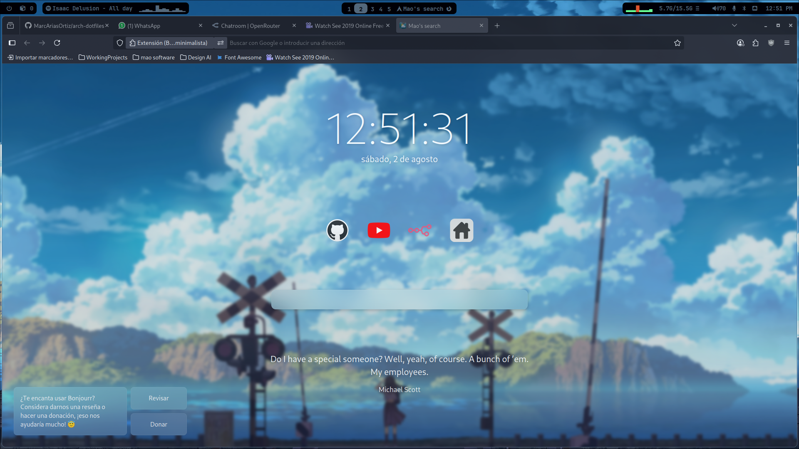
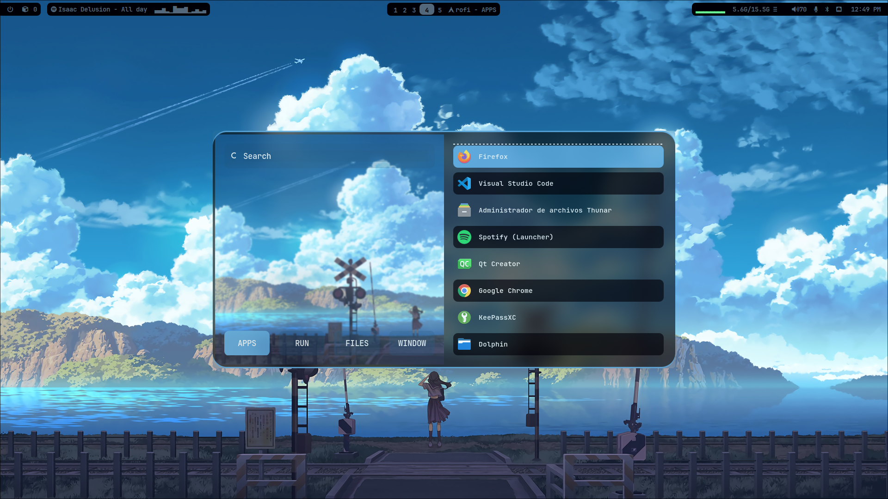
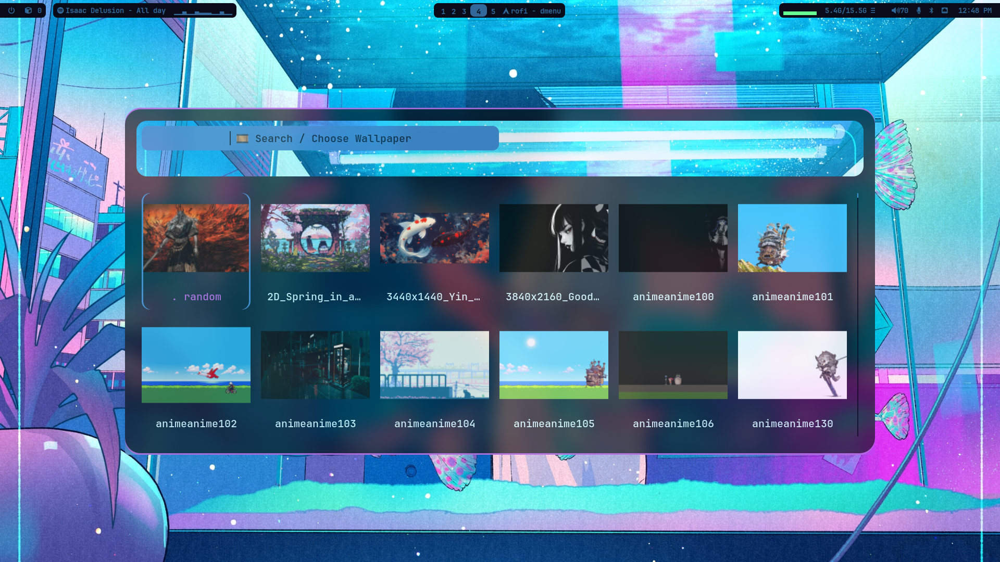
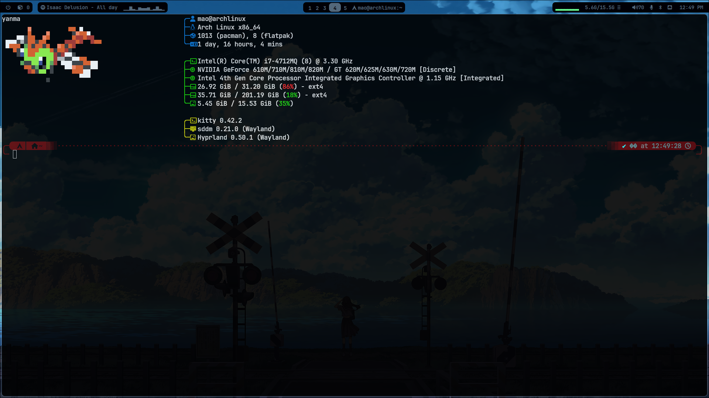
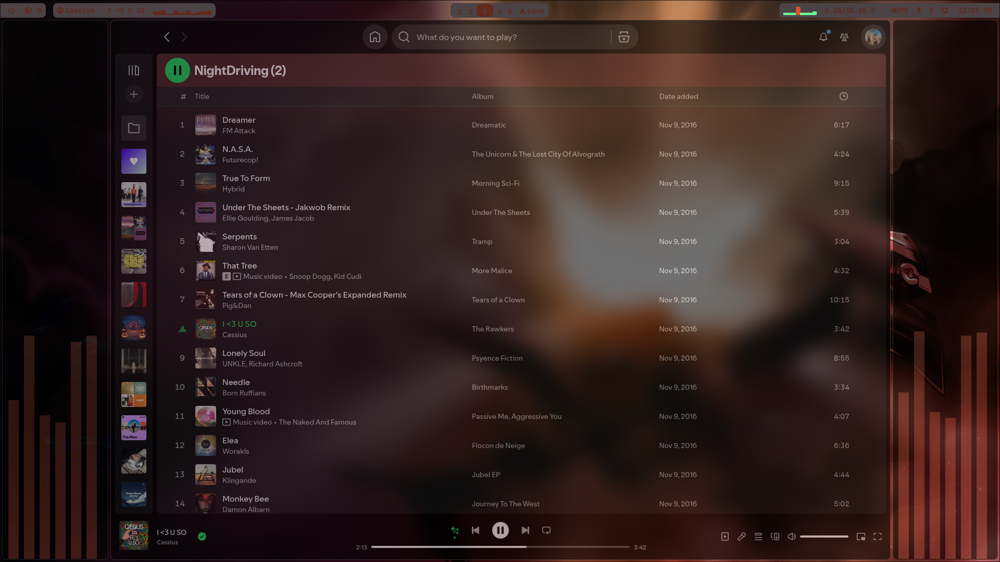

# MAO dotfiles

This contains the main configs to get your arch look like that:

| Wallpaper 1 | Wallpaper 2 | Wallpaper 3 |
|--------------|--------------|--------------|
|  |  |  |
| Thunar Files | Firefox | Programs |
|  |  |  |
| select Wallpaper | Shell | Spotify |
|  |  |  |

## Instalation

- First clone this repo
- If in your `~/.config/` you have some of the following folders `cava`, `fastfetch`, `hypr`, `kitty`, `nvim`, `rofi`, `wallust` or `waybar` make a backup and delete it and run the following script:

```bash
ln - s /clone_repo_path/dotfiles/rofi ~/.config/rofi
ln - s /clone_repo_path/dotfiles/cava ~/.config/cava
ln - s /clone_repo_path/dotfiles/fastfect ~/.config/fastfetch
ln - s /clone_repo_path/dotfiles/hypr ~/.config/hypr
ln - s /clone_repo_path/dotfiles/kitty ~/.config/kitty
ln - s /clone_repo_path/dotfiles/nvim ~/.config/nvim
ln - s /clone_repo_path/dotfiles/waybar ~/.config/waybar
ln - s /clone_repo_path/dotfiles/wallust ~/.config/wallust
ln /clone_repo_path/dotfiles/.zshrc ~/.zshrc
```
- For the sddm config run the following script:
```bash
ln - s /clone_repo_path/dotfiles/sddm/themes/mao-theme /usr/share/sddm/themes/mao-theme
```
- Change your theme conf in `/etc/sddm.conf`

## Wallpapers

To get the same wallpapers as me just look for this repo:
- ...


## ChatBot + n8n

Work in progress

AI Integrations with pasted text or text showed in screen.

Watch the following repos:
- ...
- ...

## Inspiration

- https://github.com/JaKooLit/Arch-Hyprland
- https://github.com/adi1090x/rofi
- https://github.com/Keyitdev/sddm-astronaut-theme
- https://github.com/Xakak/Updated-Dotfiles